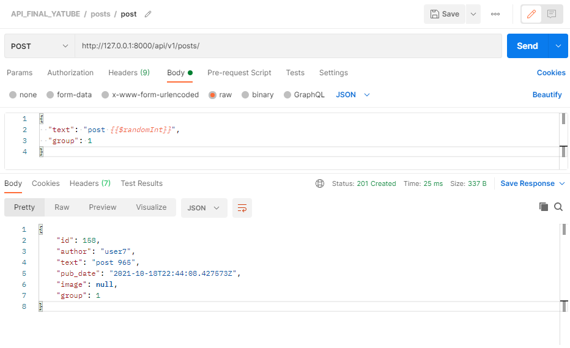
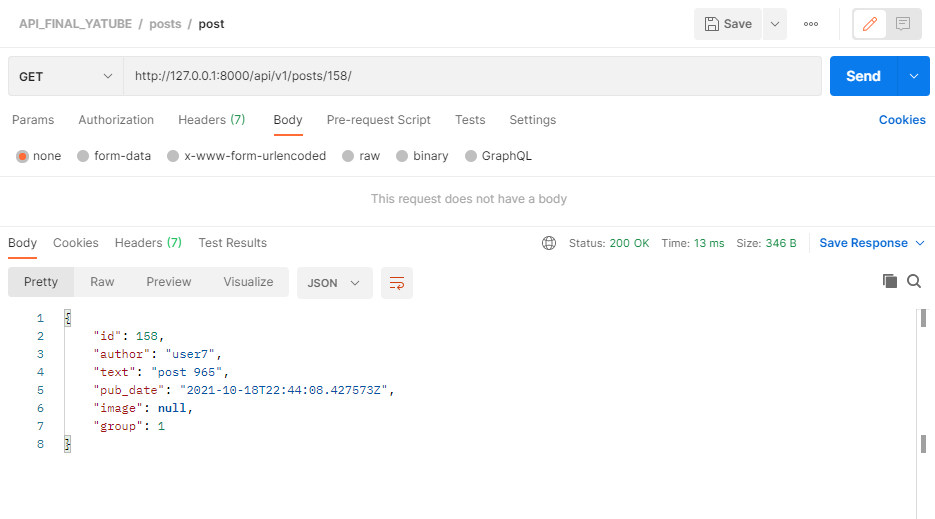
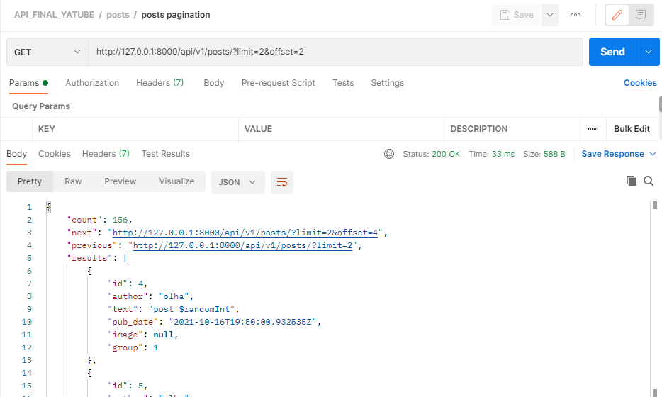
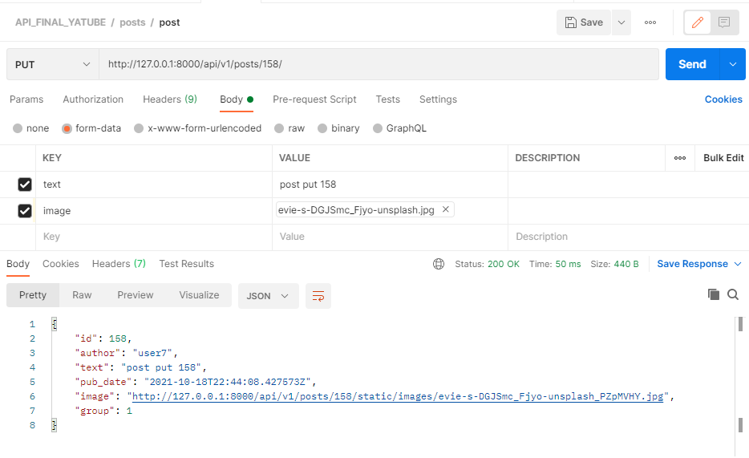
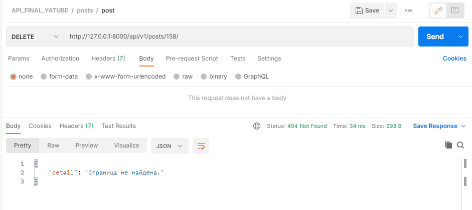
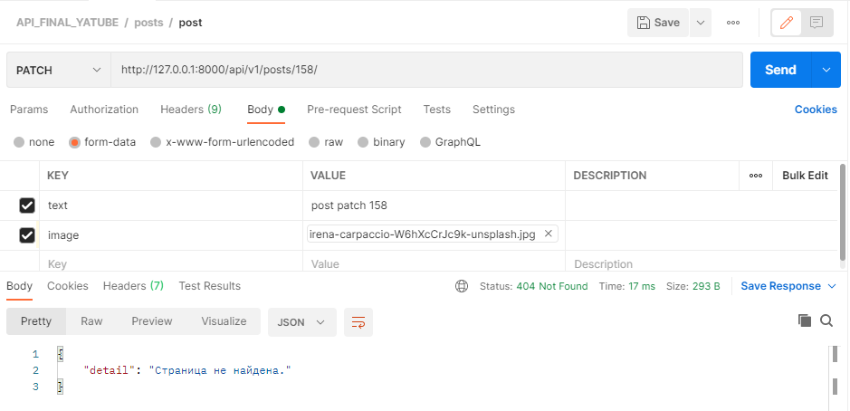
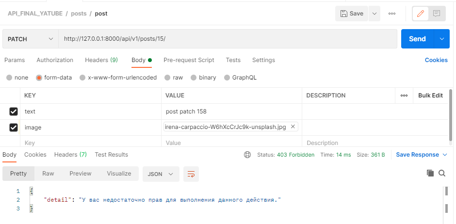

# api_final_yatube 🛫 ⛅ 🛬
***
api_final_yatube is DRF project which consists of posts and api apps.
Posts app includes models for db;
Api app includes urlpatterns, views (ModelViewSet), serializers.
The main idea of the api_final_yatube is:
> * to give opportunity to get authentication with JWTAuthentication;
> * to get, create, update and delete post/posts with IsAuthenticatedOrReadOnly permission (get list of posts paginated with LimitOffsetPagination);
> * to get, create, update and delete comment/comments to post with IsAuthenticatedOrReadOnly permission;
> * to get group/groups with IsAuthenticatedOrReadOnly permission;
> * to follow user, get list of followings and perform search with following name with IsAuthenticated permission.


### setup and run 🛠 :
***
clone the repo and CD in CLI 
```
git clone https://github.com/olhao/api_final_yatube.git
```
```
cd api_final_yatube
```

create and activate virtual environment 
```
python -m venv env
```
```
source env/bin/activate
```
```
python -m pip install --upgrade pip
```

setup dependences from file requirements.txt 
```
pip install -r requirements.txt
```

perform migrations 
```
python manage.py makemigrations
```
```
python manage.py migrate
```

run the project 
```
python manage.py runserver
```

### examples for Posts with Postman 💡
***
```
POST http://127.0.0.1:8000/api/v1/posts/
```



```
GET http://127.0.0.1:8000/api/v1/posts/158/
```



```
PATCH http://127.0.0.1:8000/api/v1/posts/158/
```


```
GET http://127.0.0.1:8000/api/v1/posts/?limit=2&offset=2 with pagination
```



```
PUT http://127.0.0.1:8000/api/v1/posts/158/
```



```
DELETE http://127.0.0.1:8000/api/v1/posts/158/
```


Couple Negative scenarios:

```
DELETE already deleted post with id to get 404 status
```



```
PATCH already deleted post with id to get 404 status
```



```
PATCH the post that created with another user
```



